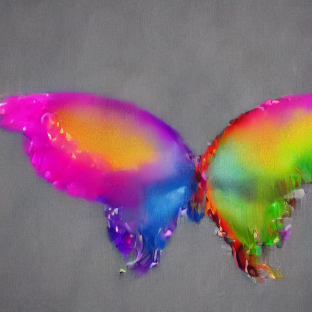

# 🎨 Little Picasso — Stable Diffusion Image Generation

A collection of Jupyter notebooks for experimenting with **Stable Diffusion** text-to-image generation, including prompt engineering, pipeline configuration, and iterative refinement of generated outputs.

---

## 📋 Table of Contents

- [Overview](#overview)
- [Repository Structure](#repository-structure)
- [Notebooks](#notebooks)
- [Helper Module](#helper-module)
- [Requirements](#requirements)
- [Getting Started](#getting-started)
- [Usage](#usage)
- [Generated Images](#generated-images)

---

## Overview

This project explores the capabilities of **Stable Diffusion** for AI-driven image generation. The notebooks demonstrate how to:

- Load and configure a Stable Diffusion pipeline using Hugging Face `diffusers`
- Generate images from text prompts
- Tune generation parameters (steps, guidance scale, seeds)
- Visualise and compare multiple generated outputs side by side
- Interact with a local LLM via Ollama as a prompt assistant

The project is named *Little Picasso* — a nod to generative AI as a creative tool.

---

## Repository Structure

```
StableDiffusionGeneratedImages/
│
├── StableFusion.ipynb          # Baseline Stable Diffusion pipeline
├── ImprovedSD.ipynb            # Refined pipeline with parameter tuning
├── OllamaChat.ipynb            # Local LLM chat via Ollama integration
├── functions.py                # Shared helper functions (image plotting)
├── img/                        # Sample generated images
│   └── image1.png
└── README.md
```

---

## Notebooks

### `StableFusion.ipynb`
The foundational notebook. Sets up the Stable Diffusion pipeline using Hugging Face `diffusers` and generates images from text prompts. A good starting point for understanding the basic pipeline.

**Key steps:**
- Load a pre-trained SD model from the Hugging Face Hub
- Configure the pipeline (scheduler, device, dtype)
- Generate images from text prompts
- Visualise results using `matplotlib`

---

### `ImprovedSD.ipynb`
An enhanced version of the baseline notebook with parameter refinements. Explores how different settings affect image quality and coherence.

**Key improvements over baseline:**
- Control over the number of inference steps
- Guidance scale tuning for prompt adherence vs. creativity
- Seed control for reproducibility
- Batch generation and side-by-side comparison

---

### `OllamaChat.ipynb`
Integrates a **locally-running LLM via Ollama** to assist with prompt generation and refinement. Useful for exploring how language models can enhance the text-to-image workflow.

**Key features:**
- Connects to a local Ollama instance
- Uses the LLM to suggest or expand image prompts
- Demonstrates a simple human-in-the-loop workflow

---

## Helper Module

### `functions.py`

A small utility module with shared plotting functionality used across notebooks.

```python
import matplotlib.pyplot as plt

def plot_images(images):
    """
    Display a list of PIL images side by side using matplotlib.

    Args:
        images (list): A list of PIL Image objects to display.
    """
    plt.figure(figsize=(20, 20))
    for i in range(len(images)):
        ax = plt.subplot(1, len(images), i + 1)
        plt.imshow(images[i])
        plt.axis("off")
```

**Usage:**
```python
from functions import plot_images
plot_images([img1, img2, img3])
```

---

## Requirements

### Python packages

```
diffusers
transformers
torch
accelerate
matplotlib
Pillow
ollama          # for OllamaChat.ipynb
```

Install via pip:

```bash
pip install diffusers transformers torch accelerate matplotlib Pillow
```

### Hardware

Stable Diffusion benefits significantly from a **GPU**. CPU-only generation is possible but slow.

| Setup | Generation Speed |
|---|---|
| NVIDIA GPU (CUDA) | Fast (~5–30s per image) |
| Apple Silicon (MPS) | Moderate (~30–120s) |
| CPU only | Slow (several minutes) |

### Ollama (for `OllamaChat.ipynb`)

Install Ollama from [https://ollama.com](https://ollama.com) and pull a model:

```bash
ollama pull llama3.2
```

---

## Getting Started

1. **Clone the repository**

```bash
git clone https://github.com/alketcecaj12/StableDiffusionGeneratedImages.git
cd StableDiffusionGeneratedImages
```

2. **Create a virtual environment** (recommended)

```bash
python -m venv venv
source venv/bin/activate        # macOS/Linux
venv\Scripts\activate           # Windows
```

3. **Install dependencies**

```bash
pip install diffusers transformers torch accelerate matplotlib Pillow
```

4. **Launch Jupyter**

```bash
jupyter notebook
```

5. Open `StableFusion.ipynb` to start with the baseline pipeline, or `ImprovedSD.ipynb` for the refined version.

---

## Usage

### Basic image generation

```python
from diffusers import StableDiffusionPipeline
import torch
from functions import plot_images

pipe = StableDiffusionPipeline.from_pretrained(
    "runwayml/stable-diffusion-v1-5",
    torch_dtype=torch.float16
)
pipe = pipe.to("cuda")  # or "mps" for Apple Silicon

prompt = "a futuristic city at sunset, digital art, highly detailed"
images = pipe(prompt, num_images_per_prompt=3).images

plot_images(images)
```

### Key parameters to tune

| Parameter | Effect |
|---|---|
| `num_inference_steps` | More steps → higher quality, slower |
| `guidance_scale` | Higher → more prompt-faithful, less diverse |
| `generator` (seed) | Fix for reproducibility |
| `negative_prompt` | Describe what to avoid |

---

## Generated Images

Sample outputs are stored in the `img/` directory.



---

## Notes

- Large model weights (~4–8 GB) are downloaded from Hugging Face Hub on first run.
- A Hugging Face account and access token may be required for certain gated models.
- For corporate or offline environments, models can be downloaded separately and loaded from a local path.
